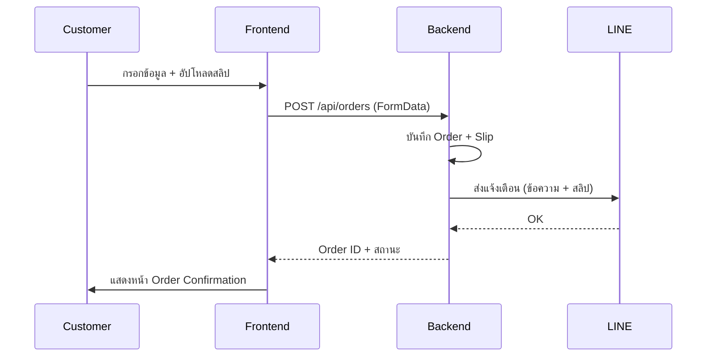

# Payment System & LINE Notify Integration

## Overview
สร้างระบบชำระเงินที่สมบูรณ์ รองรับการอัปโหลดสลิป สร้างใบเสร็จ และส่งแจ้งเตือนไป LINE

## User Review Required

> [!IMPORTANT]
> **LINE Notify Token Required**
> คุณต้องสร้าง LINE Notify Token ก่อน โดย:
> 1. ไปที่ https://notify-bot.line.me/my/
> 2. คลิก "Generate Token"
> 3. ตั้งชื่อ Token (เช่น "Thai Herb Orders")
> 4. เลือก "1-on-1 chat" หรือ Group ที่ต้องการรับแจ้งเตือน
> 5. Copy Token มาใส่ใน `.env` ของ backend

> [!WARNING]
> **สำหรับ Production**: ควรทดสอบก่อนใช้งานจริง และอาจต้องพิจารณา:
> - การเก็บ Order ลง Database
> - ระบบ Order Tracking
> - Email Notification เพิ่มเติม

---

## Proposed Changes

### Backend - Routes

#### [NEW] [orders.js](file:///c:/test_ai/thaiherb/backend/routes/orders.js)
สร้าง API endpoint สำหรับ:
- `POST /api/orders` - สร้าง Order ใหม่ พร้อม upload slip
- ส่งแจ้งเตือนไป LINE พร้อมรายละเอียด Order และ slip

---

### Backend - Services

#### [NEW] [lineNotify.js](file:///c:/test_ai/thaiherb/backend/services/lineNotify.js)
Service สำหรับส่งข้อความไป LINE Notify:
- `sendTextMessage(message)` - ส่งข้อความ
- `sendImageWithMessage(message, imagePath)` - ส่งข้อความพร้อมรูป (slip)

---

### Backend - Configuration

#### [MODIFY] [server.js](file:///c:/test_ai/thaiherb/backend/server.js)
- เพิ่ม route สำหรับ orders
- เพิ่ม static folder สำหรับ uploads

#### [MODIFY] [.env](file:///c:/test_ai/thaiherb/backend/.env)
- เพิ่ม `LINE_NOTIFY_TOKEN`

---

### Frontend - Pages

#### [MODIFY] [Checkout.jsx](file:///c:/test_ai/thaiherb/src/pages/Checkout.jsx)
- เพิ่มส่วนอัปโหลดสลิป (Drag & Drop หรือคลิกเลือกไฟล์)
- แสดง Preview รูปสลิปก่อนส่ง
- ส่ง Order ไปยัง Backend

#### [NEW] [OrderConfirmation.jsx](file:///c:/test_ai/thaiherb/src/pages/OrderConfirmation.jsx)
- หน้าแสดงผลเมื่อสั่งซื้อสำเร็จ
- แสดงเลขที่คำสั่งซื้อ
- แสดงใบเสร็จ/สรุปรายการ
- ปุ่มบันทึกใบเสร็จ (Download)

---

### Frontend - Services

#### [MODIFY] [api.js](file:///c:/test_ai/thaiherb/src/services/api.js)
- เพิ่ม `submitOrder(formData)` - ส่ง Order พร้อม slip ไป backend

---

### Frontend - Routing

#### [MODIFY] [App.jsx](file:///c:/test_ai/thaiherb/src/App.jsx)
- เพิ่ม route สำหรับ `/order-confirmation`

---

## Flow Overview

---

## Verification Plan

### Manual Verification
1. **ขั้นตอนทดสอบ:**
   - เปิดหน้าเว็บ → เพิ่มสินค้าลงตะกร้า → ไปหน้า Checkout
   - กรอกข้อมูลลูกค้า
   - เลือกวิธีชำระ "โอนเงิน" → อัปโหลดสลิป (รูปภาพใดก็ได้)
   - กด "ยืนยันการสั่งซื้อ"
   - ตรวจสอบว่า:
     - ✅ แสดงหน้า Order Confirmation พร้อมเลขที่คำสั่งซื้อ
     - ✅ ได้รับแจ้งเตือนใน LINE พร้อมรายละเอียดและสลิป

2. **สิ่งที่ต้องการจากคุณ:**
   - LINE Notify Token (จะต้องใส่ใน `.env`)
   - รูปภาพสำหรับทดสอบ (สลิปจำลอง)

---

## Summary
| Component | Action | Files |
|-----------|--------|-------|
| Backend Routes | NEW | `orders.js` |
| Backend Services | NEW | `lineNotify.js` |
| Backend Config | MODIFY | `server.js`, `.env` |
| Frontend Pages | MODIFY/NEW | `Checkout.jsx`, `OrderConfirmation.jsx` |
| Frontend Services | MODIFY | `api.js` |
| Frontend Routing | MODIFY | `App.jsx` |
